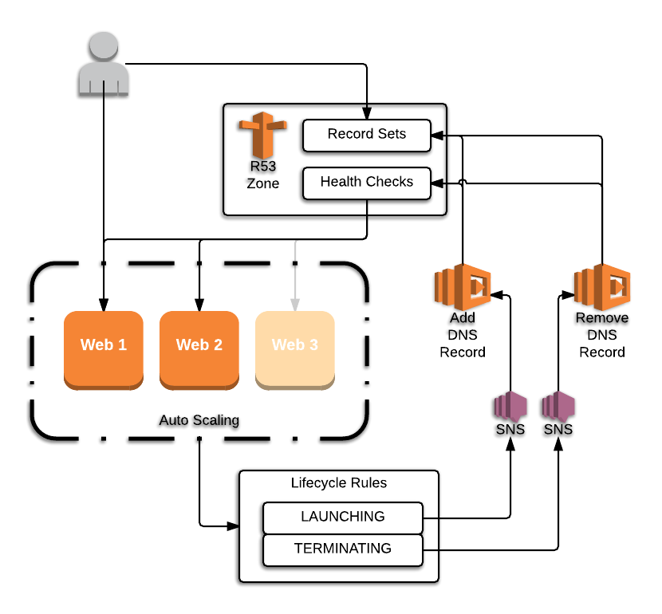

# Terraform Route53 Autoscaling Example

## Summary

This repo demonstrates a Terraform configuration for creating and removing AWS Route 53 entries on a DNS record set when EC2 instances are created or terminated as part of an Autoscaling Group. It does this by sending notifications to SNS via the Autoscaling lifecycle rules and using Lambda functions to add or remove the DNS entries.

## High Level Diagram


## Getting Started

AWS credentials are assumed to be profiles in your `~/.aws/credentials` file. 

Amend backend state config in `terraform/main.tf`

Enter the terraform directory and create a  `terraform.tfvars` file with the following:

```
subnet_id   = "subnet-12345678"
dns_zone    = "mysite.com."
dns_prefix  = "www"
key_name    = "tt-dsul"
region      = "eu-west-2"
ami_name    = "my-ami*"
```

The dns zone will used to lookup your zone id in Route 53. Ensure it has the . at the end.

The dns_prefix will be used to form your fqdn and in the set name for the weighted dns records.

The ami_name is used as a search string for your ami in your account. Look in packer for a simple packer script to build an ubuntu apache ami.


### Build

Enter the `terraform` directory and run `terraform init` 
`terraform plan` to see changes to be applied 
`terraform apply` to spin the environment up. 


